# GoBus Express

**Faster, smarter bus travel.** A Flutter mobile app for booking intercity bus tickets in Cambodia — search routes, pick a seat, pay with KHQR/Bakong or wallet, and get a digital e-ticket with real-time trip updates.

## Screenshots

<p align="center">
  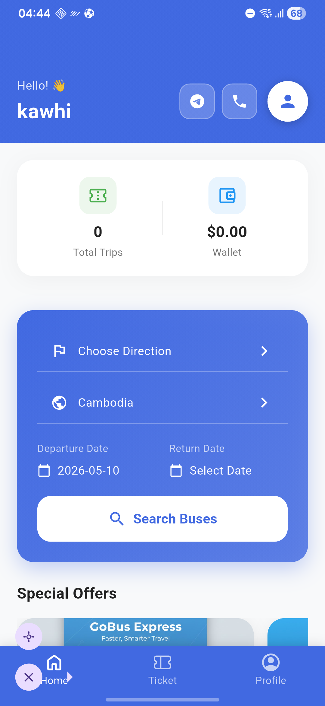
</p>

**Home & account**

<p align="center">
  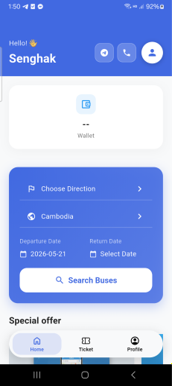
  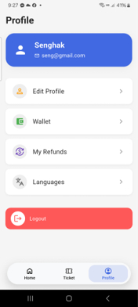
  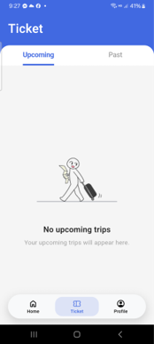
</p>

**Booking flow**

<p align="center">
  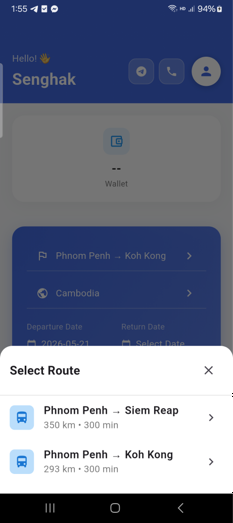
  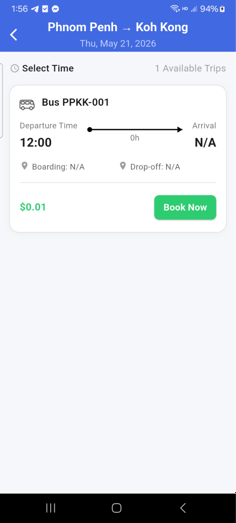
  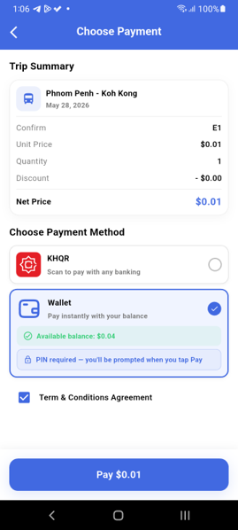
</p>

**Payments & wallet**

<p align="center">
  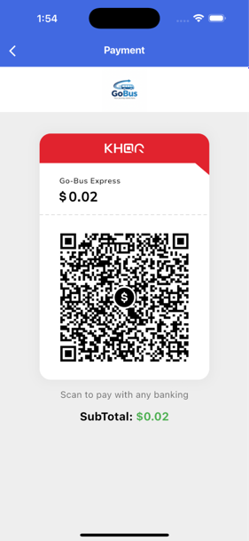
  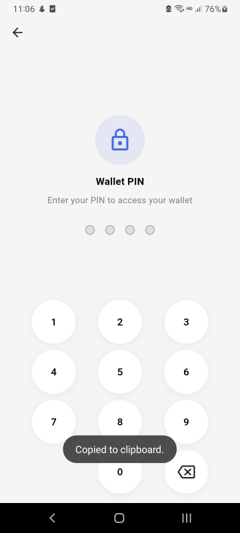
  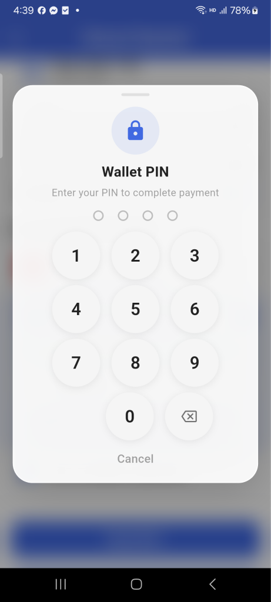
</p>

<p align="center">
  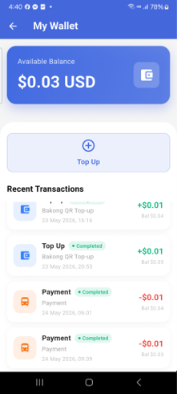
  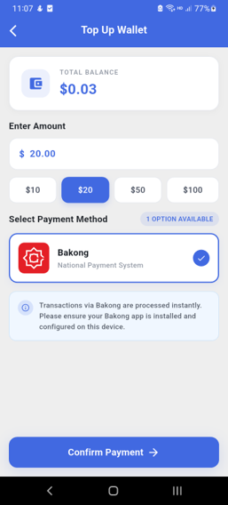
  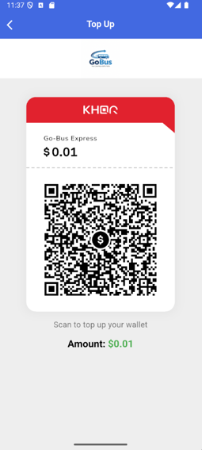
</p>

<p align="center">
  
  
  
</p>

**Tickets & refunds**

<p align="center">
  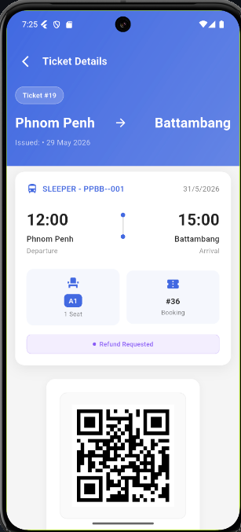
  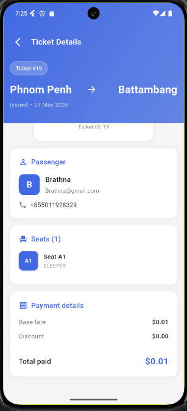
  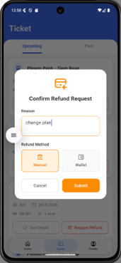
</p>

## Features

- 🔍 **Route search & booking** — choose direction, departure/return date, and browse available buses
- 💺 **Seat selection** — interactive seat map per trip
- 🎫 **Digital tickets** — view booking history and ticket/QR details, no paper needed
- 💳 **Payments** — KHQR / Bakong QR payment, in-app wallet with top-up and withdrawal
- 🔁 **Refunds** — request and track ticket refunds
- 🔔 **Push & local notifications** — booking and payment status updates via Local Notification
- 📡 **Real-time updates** — STOMP/WebSocket connection for live payment and trip status
- 🌐 **Offline awareness** — connectivity monitoring with graceful fallback messaging
- 🌍 **Localization** — multi-language support (English / Khmer)
- 👤 **Account management** —  Profile editing, PIN code security

## Tech stack

- **Language & framework:** Dart 3.8 / Flutter (stable channel)
- **State management / DI:** [GetX](https://pub.dev/packages/get) (controllers, routing, reactive state) + [get_it](https://pub.dev/packages/get_it) for dependency injection
- **Networking:** [Dio](https://pub.dev/packages/dio) + [Retrofit](https://pub.dev/packages/retrofit) for typed REST clients, with auth/token-refresh and connectivity interceptors
- **Real-time:** [stomp_dart_client](https://pub.dev/packages/stomp_dart_client) / [web_socket_channel](https://pub.dev/packages/web_socket_channel)
- **Local storage:** [Hive](https://pub.dev/packages/hive) + `shared_preferences`
- **Payments:** [khqr_sdk](https://pub.dev/packages/khqr_sdk), [qr_flutter](https://pub.dev/packages/qr_flutter)
- **Firebase:** Core, Cloud Messaging, with `flutter_local_notifications`
- **Code generation:** `json_serializable`, `retrofit_generator`, `build_runner`
- **Other notable libraries:** `flutter_bloc`/`equatable` (select feature modules), `google_sign_in`, `connectivity_plus`, `cached_network_image`, `lottie`, `flutter_dotenv`

## Architecture

The app follows an **MVVM-style layering with a reducer-based state container**, on top of a repository pattern:

```
view/            UI screens & widgets (Flutter)
        ↓ user actions
view_models/     GetX controllers — hold immutable UI state, expose emit()/updateState()
        ↓ calls
repository/      Domain-facing repositories — orchestrate data sources, cache via Hive
        ↓ calls
data/            Retrofit API clients (auth, booking, payment, ticket, wallet, refund...)
        ↓
core/            Cross-cutting: network (Dio + interceptors), DI (get_it), services
                 (notifications, connectivity, websocket), local storage
```

- `core/di/app_di.dart` wires up Dio clients, API services, and repositories via `get_it`.
- `BaseController<T>` (`view_models/controller/base/base_controller.dart`) implements a small MVI-like pattern: each controller holds a single immutable state object updated through `emit`/`updateState`, which views observe reactively.
- A dedicated `features/` module (e.g. `billing`) hosts newer, self-contained feature slices with their own `data`/`presentation` split.

## Prerequisites

| Tool | Version |
|---|---|
| Flutter SDK | stable channel, compatible with Dart `^3.8.0` |
| Dart SDK | 3.8.0 or higher (bundled with Flutter) |
| Android Studio | latest stable, with Android SDK + NDK installed |
| Android Gradle Plugin | 8.9.1 (configured in `android/settings.gradle.kts`) |
| Kotlin | 1.8.22 |
| Android `minSdk` / `targetSdk` | per installed Flutter embedding defaults (`flutter.minSdkVersion` / `flutter.targetSdkVersion`) |
| Xcode (iOS builds) | latest stable, with CocoaPods installed |
| iOS deployment target | 15.0 |
| Firebase project | required for push notifications (`google-services.json` / `GoogleService-Info.plist`) |

## Setup / installation

1. **Clone the repo**

   ```bash
   git clone <repository-url>
   cd go_bus_express
   ```

2. **Install Flutter dependencies**

   ```bash
   flutter pub get
   ```

3. **Configure environment variables**

   This project loads secrets from a `.env` file at the project root (not committed to git). Create one with:

   ```env
   BASE_URL=<your API base URL>
   WS_BASE_URL=<your WebSocket/STOMP base URL>
   PROD_BASE_URL=<your production API base URL>
   ```

4. **Add Firebase configuration**

   - Android: place `google-services.json` in `android/app/`
   - iOS: place `GoogleService-Info.plist` in `ios/Runner/`
   - Both platforms are wired through `lib/firebase_options.dart` (FlutterFire CLI: `flutterfire configure`)

5. **Generate code** (models, Retrofit clients)

   ```bash
   dart run build_runner build --delete-conflicting-outputs
   ```

6. **iOS only** — install CocoaPods dependencies

   ```bash
   cd ios && pod install && cd ..
   ```

7. **Run the app**

   ```bash
   flutter run
   ```

## Project structure

```
go_bus_express/
├── lib/
│   ├── core/          # network, DI, services, storage, utils
│   ├── data/           # Retrofit API clients
│   ├── features/      # self-contained feature modules (e.g. billing)
│   ├── models/         # JSON-serializable data models
│   ├── repository/    # repositories bridging data + view_models
│   ├── resources/     # localization, routes
│   ├── view/           # screens & widgets
│   └── view_models/  # GetX controllers (state + business logic)
├── android/
├── ios/
└── assets/
```
